| Code Files | Outputs |
|------------|---------|
|['1.txt'](./Codes/1.txt)||
|['2.txt'](./Codes/2.txt)|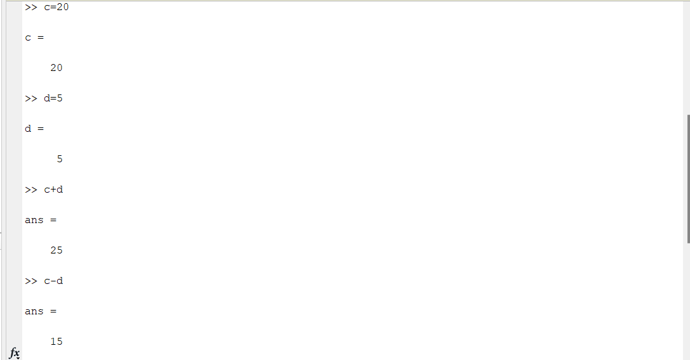|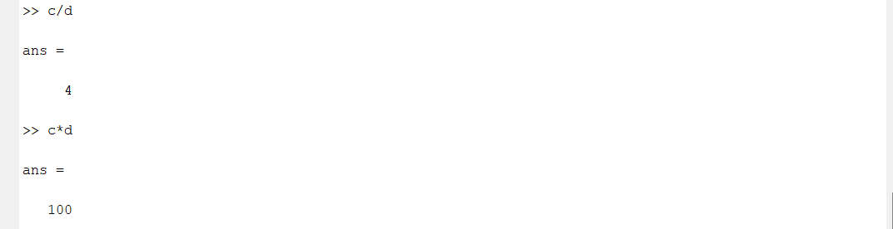|
|['3.txt'](./Codes/3.txt)|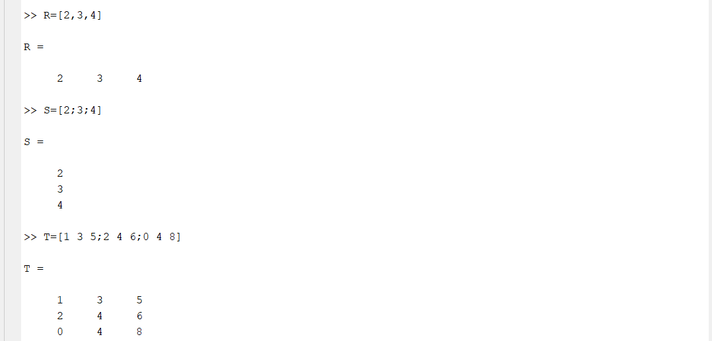|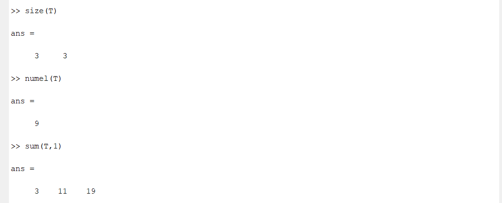|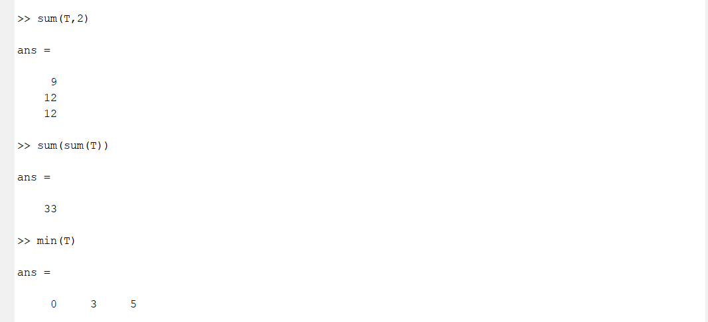||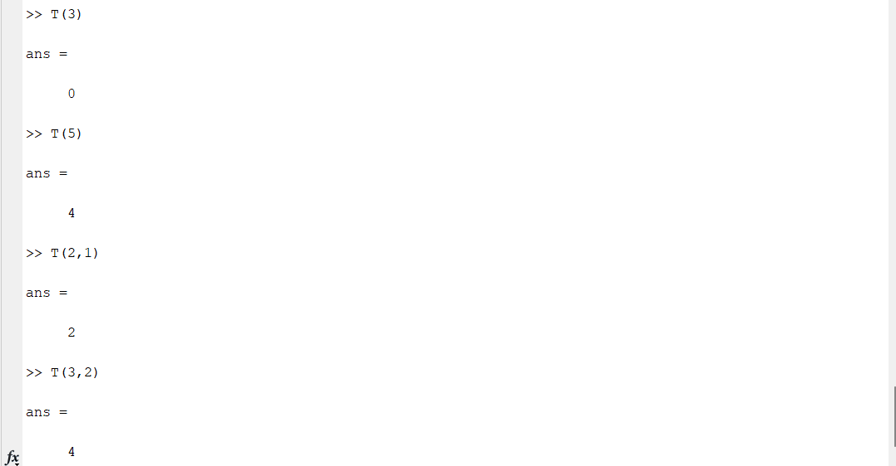|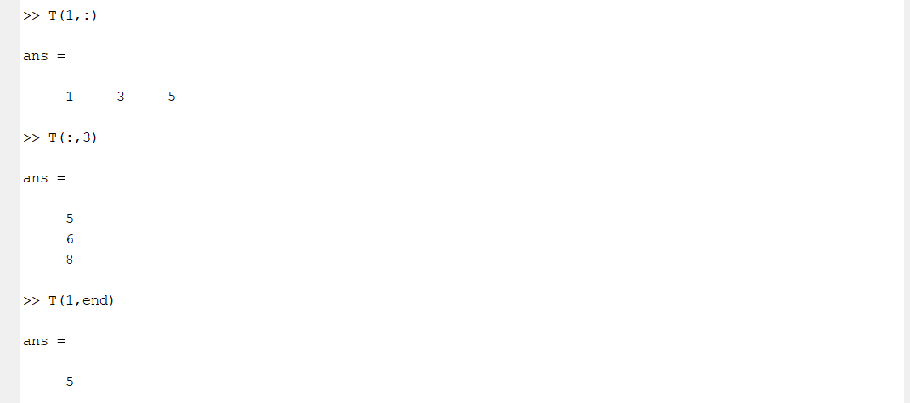|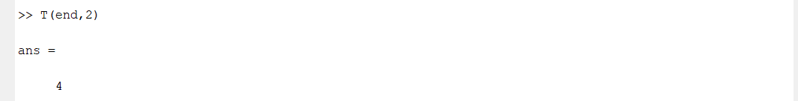|
|['4.txt'](./Codes/4.txt)|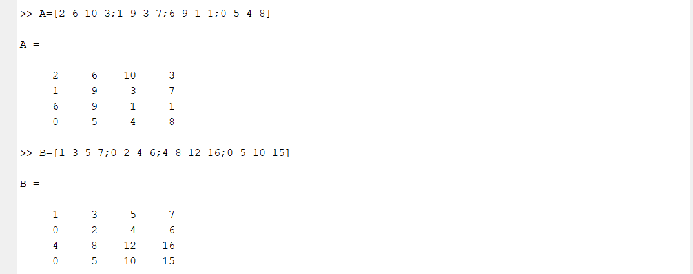||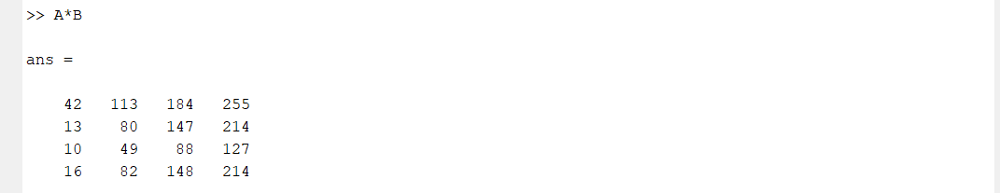|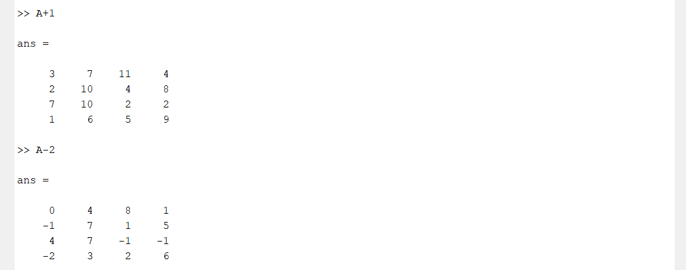|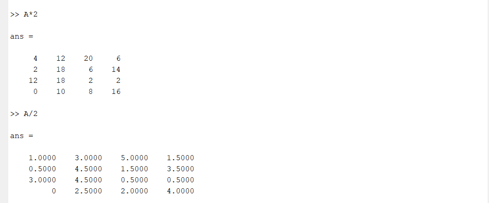|
|['5.txt'](./Codes/5.txt)|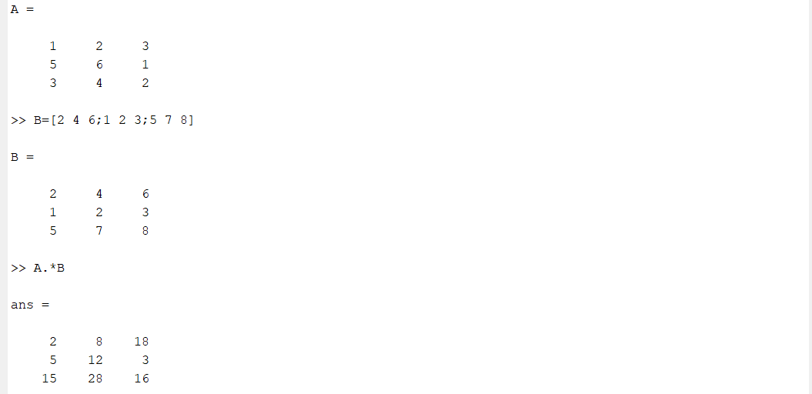|
|['6.txt'](./Codes/6.txt)|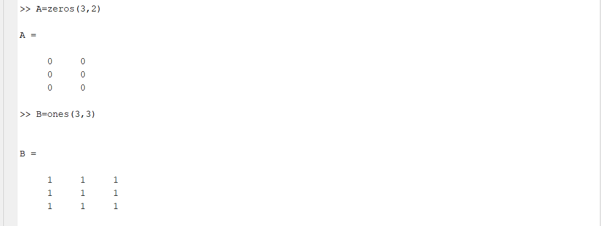|
|['7.txt'](./Codes/7.txt)|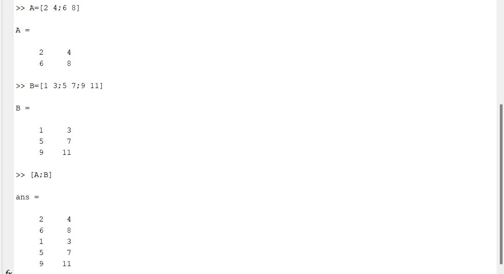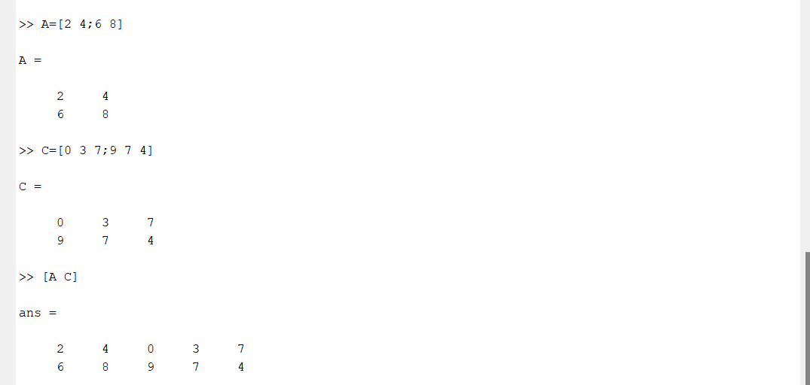|
|['8-1.txt'](./Codes/8-1.txt)|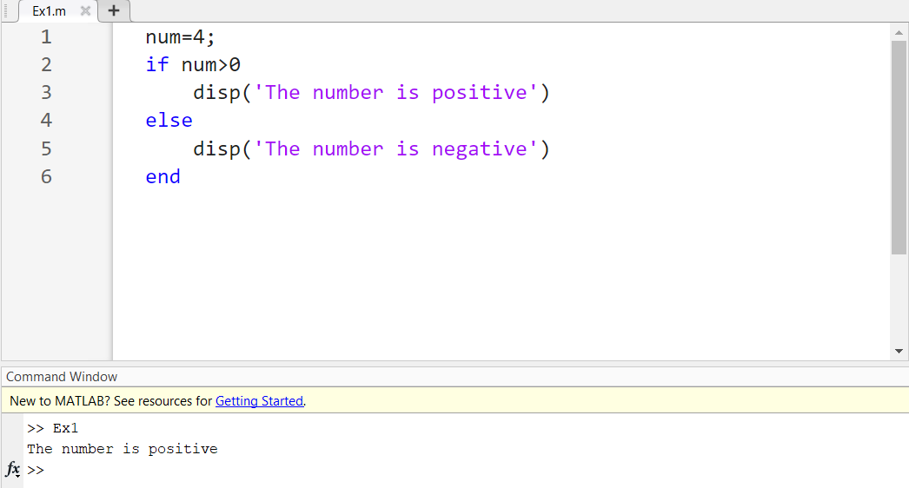|
|['8-2.txt'](./Codes/8-2.txt)|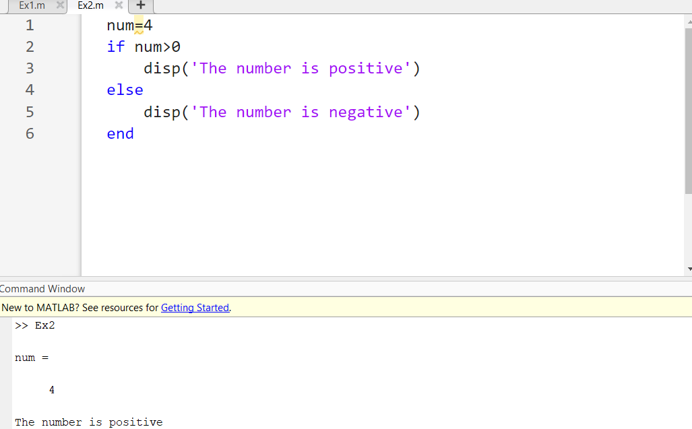|
|['8-3.txt'](./Codes/8-3.txt)|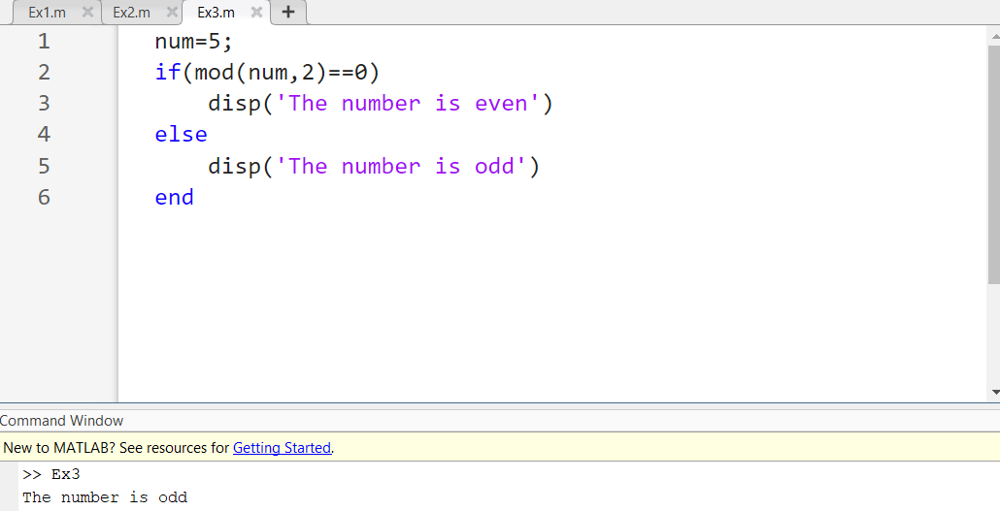|

