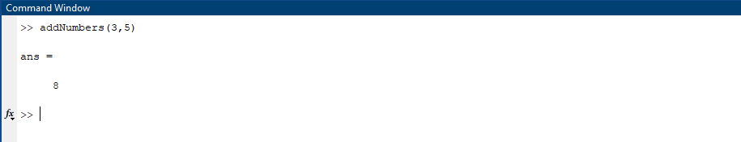
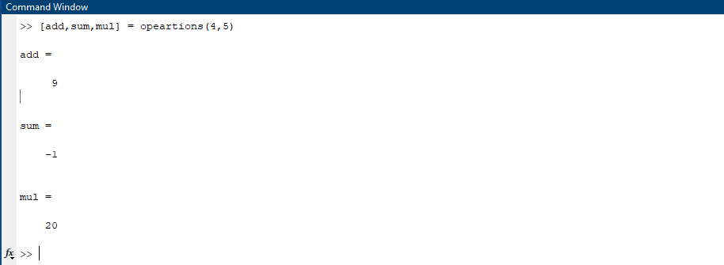
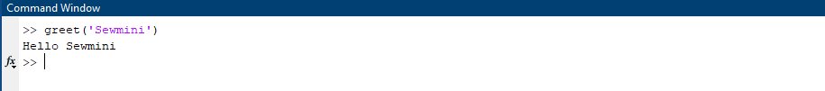
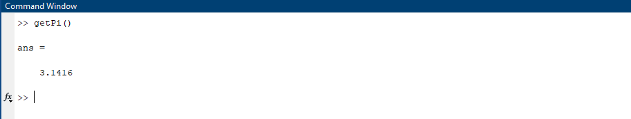
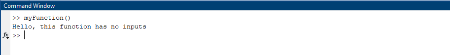
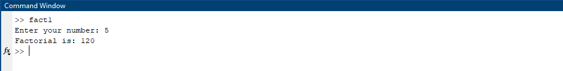
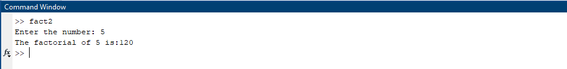

| Code Files | Outputs |
|------------|---------|
|['addNumbers.m'](./Codes/addNumbers.m)||
|['opeartions.m'](./Codes/opeartions.m)||
|['greet.m'](./Codes/greet.m)||
|['getPi.m'](./Codes/getPi.m.)||
|['myFunction.m'](./Codes/myFunction.m)||
|['fact1.m'](./Codes/fact1.m.)||
|['fact2.m'](./Codes/fact2.m.)||
