| Code Files | Outputs |
|------------|---------|
|['graph1.m'](./Codes/graph1.m.txt)|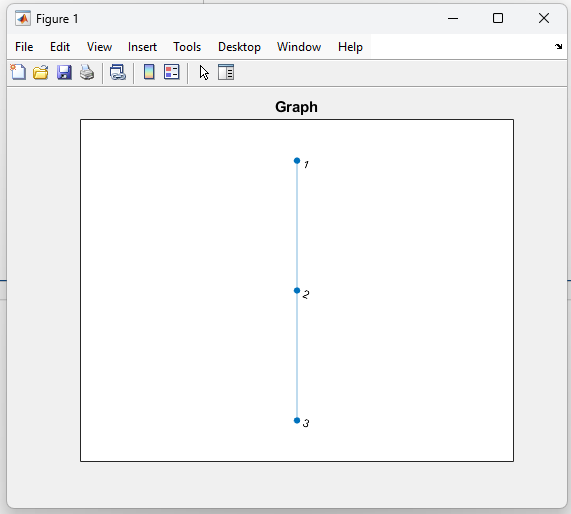|
|['graph2.m'](./Codes/graph2.m.txt)||
|['graph3.m'](./Codes/graph3.m.txt)|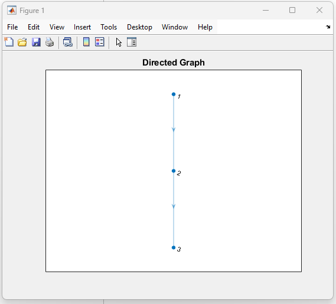|
|['graph4.m'](./Codes/graph4.m.txt)|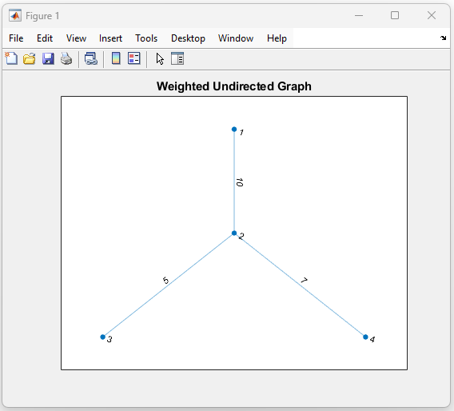|
|['graph5.m'](./Codes/graph5.m.txt)|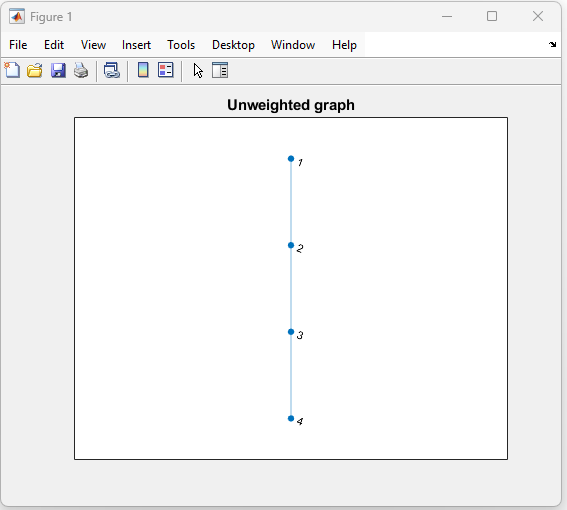|
|['weighted_directed_graph.m'](./Codes/weighted_directed_graph.m)||
|['shape.m'](./Codes/shape.m.txt)|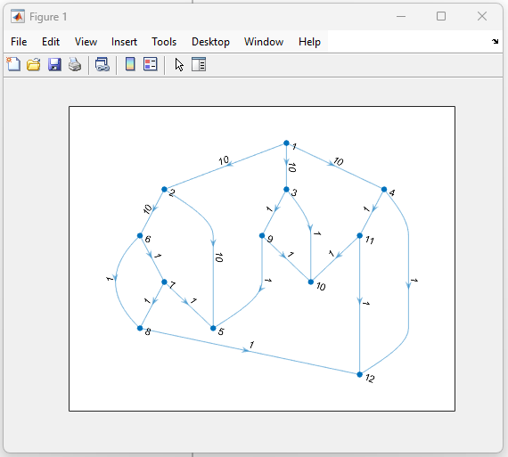|
|['shape1.m'](./Codes/shape1.m.txt)|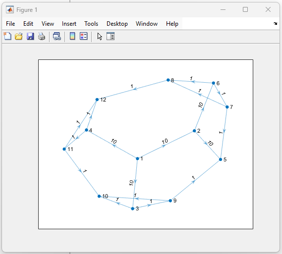|
|['shape2.m'](./Codes/shape2.m.txt)|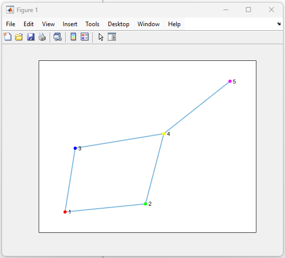|
|['shape3.m'](./Codes/shape3.m.txt)|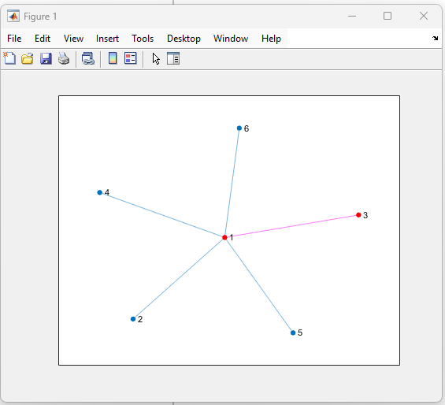|
|['shape4.m'](./Codes/shape4.m.txt)|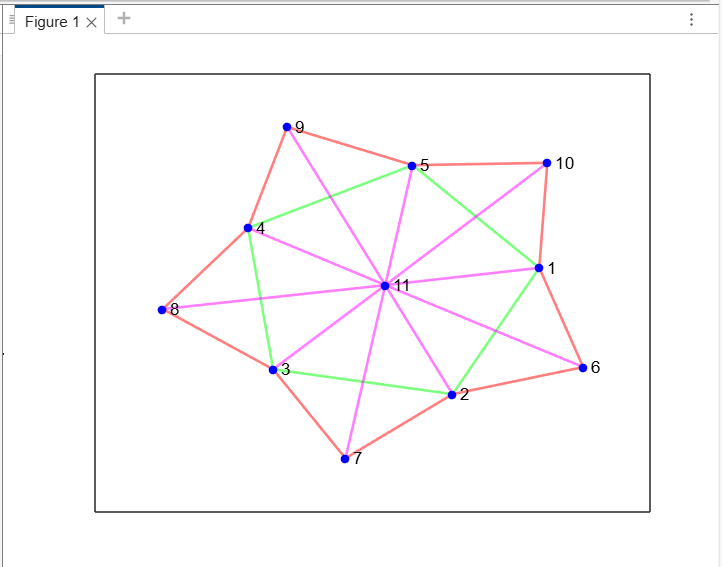|
|['adj_matrix.m'](./Codes/adj_matrix.m.txt)|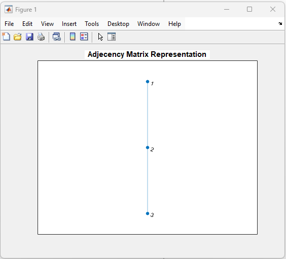|
|['adj_node.m'](./Codes/adj_node.m)|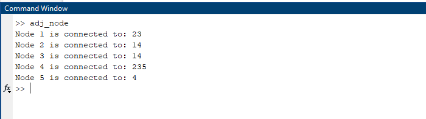|

