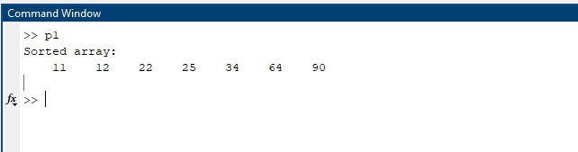
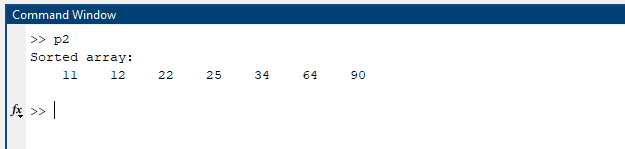
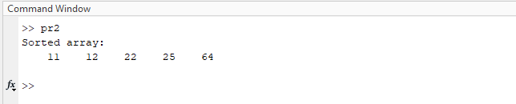
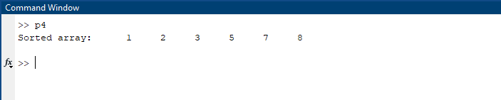
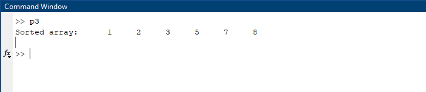

## Bubble Sort
Bubble Sort is a simple sorting algorithm that repeatedly steps through the list, compares adjacent elements, and swaps them if they are in the wrong order.

| Code File | Output Image |
|-----------|--------------|
| [p1.m](./Codes/p1.m) |  |

## Insertion Sort
Insertion Sort builds the final sorted array one item at a time, by repeatedly picking the next element and inserting it into its correct position.

| Code File | Output Image |
|-----------|--------------|
| [p2.m](./Codes/p2.m) |  |

## Selection Sort
Selection Sort divides the list into a sorted and unsorted part, repeatedly selecting the smallest (or largest) element from the unsorted part and moving it to the end of the sorted part.

| Code File | Output Image |
|-----------|--------------|
| [p3.m](./Codes/p3.m) |  |

## Quick Sort
Quick Sort is a divide-and-conquer algorithm that picks a pivot element and partitions the array around the pivot, recursively sorting the subarrays.

| Code File | Output Image |
|-----------|--------------|
| [p4.m](./Codes/p4.m) |  |

## Merge Sort
Merge Sort is a divide-and-conquer algorithm that divides the array into halves, sorts them recursively, and then merges the sorted halves.

| Code File | Output Image |
|-----------|--------------|
| [p5.m](./Codes/p5.m) |  |

