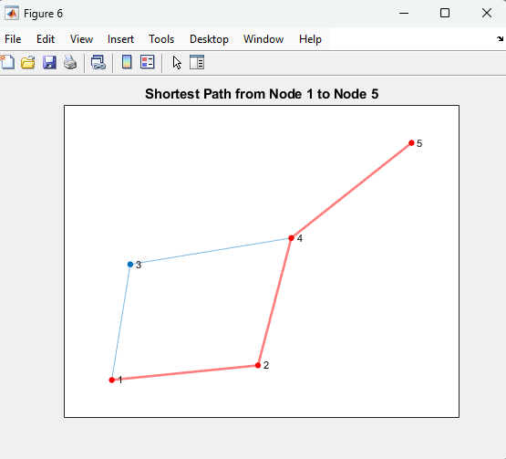

| Code Files | Outputs |
|------------|---------|
|['tree1.m'](./Codes/tree1.m)||
|['tree2.m'](./Codes/tree2.m)||
|['tree3.m'](./Codes/tree3.m)||
|['bfs_traversal.m'](./Codes/bfs_traversal.m)||
|['dfs_traversal.m'](./Codes/dfs_traversal.m)||
